# 🎉 Crude Cards

## A Party Game For Horrible People! 🎉

### Web Development Series

Welcome to **Crude Cards**, a real-time, WebSocket-enabled card game designed for both learning and fun! If you've ever played **Cards Against Humanity** or **Apples to Apples**, you already know how to play. This project is built with modern web technologies like **React**, **Next.js**, and **NestJS** to demonstrate technical concepts in a fun and engaging way.

<table>
  <tr>
    <td valign="top">
      <h3>🎯 Game Overview</h3>
      <p>Crude Cards is a <em>good</em> party game for <strong>bad</strong> people. Perfect for casual hangouts or virtual game nights. Real-time play for multiple players via a WebSocket-powered backend. Adaptable for learning games or quizzes.</p>
    </td>
    <td valign="top">
      <h3>🤓 Educational Purpose</h3>
      <p>More than entertainment—this project is a learning resource for full-stack, real-time app development. Find tutorials on building, deploying, and scaling the app in the cloud.</p>
    </td>
  </tr>
</table>

## 🎨 CrudeCards - Game Dev Series

<table cellspacing="0" cellpadding="0" border="0">
  <tr>
<td valign="top" align="center">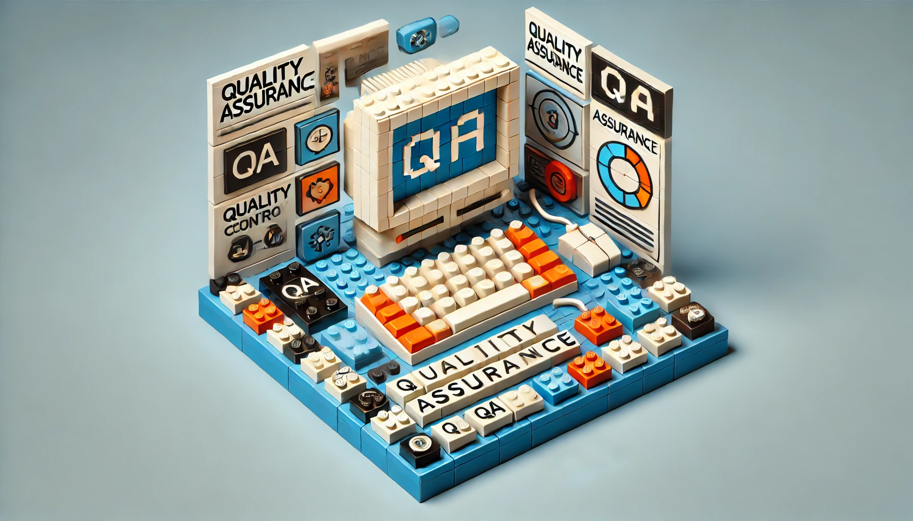<br><div align="left" style="font-family: 'Helvetica Neue Bold', Arial, sans-serif;"><strong>
    Introduction to the Series

</strong><br><br>
This article provides an overview of the series, explaining what will be covered and the goals of creating a CAH clone.

</div></td>
<td valign="top" align="center">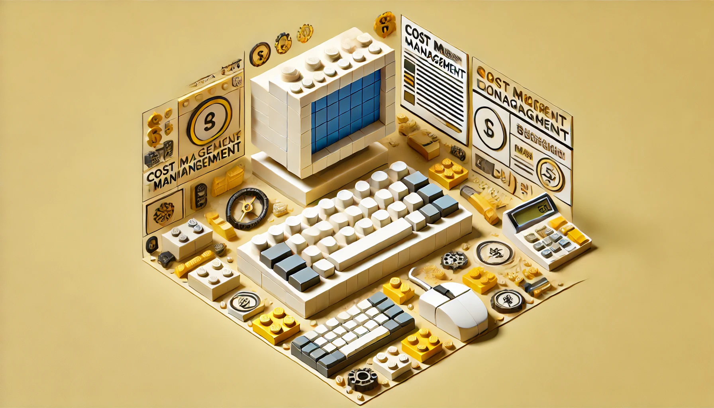<br><div align="left" style="font-family: 'Helvetica Neue Bold', Arial, sans-serif;"><strong>
    Defining the Project: What and Why
</strong><br><br>
    Detailed description of the CAH clone, including its purpose and goals.
</div></td>
<td valign="top" align="center">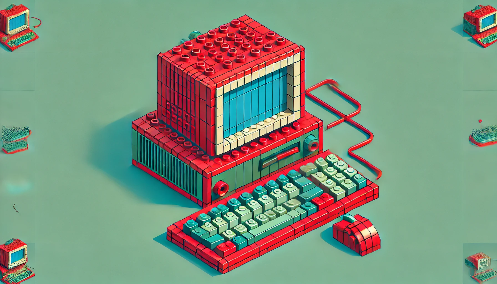<br><div align="left" style="font-family: 'Helvetica Neue Bold', Arial, sans-serif;"><strong>
    Defining the Audience and Stakeholders

</strong><br><br>

</div></td>
</tr>

<tr>
<td valign="top" align="center">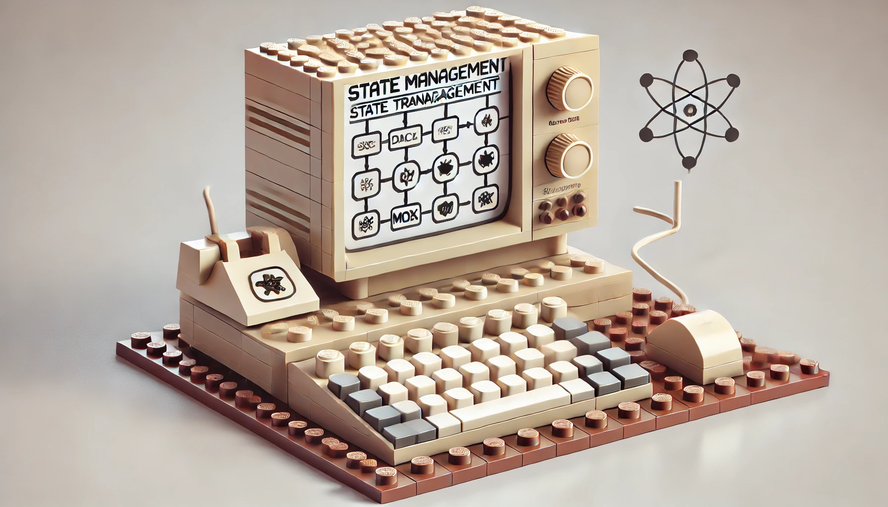<br><div align="left" style="font-family: 'Helvetica Neue Bold', Arial, sans-serif;"><strong>
    Defining Stakeholder Personas

</strong><br><br>
The process of creating example users and applying

</div></td>
<td valign="top" align="center">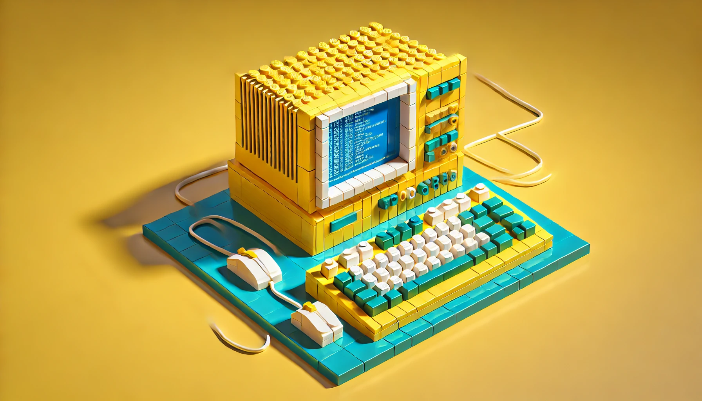<br><div align="left" style="font-family: 'Helvetica Neue Bold', Arial, sans-serif;"><strong>
    Conducting In-Person Testing and Gathering Feedback

</strong><br><br>
Methods for in-person testing and how to gather and analyze feedback.

</div></td>
<td valign="top" align="center">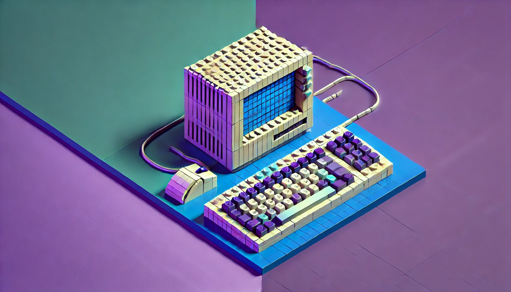<br><div align="left" style="font-family: 'Helvetica Neue Bold', Arial, sans-serif;"><strong>
    Creating Mockups and Prototypes

</strong><br><br>
Tools and techniques for creating mockups and prototypes, emphasizing their importance.

</div></td>
</tr>

<tr>
<td valign="top" align="center"><br><div align="left" style="font-family: 'Helvetica Neue Bold', Arial, sans-serif;"><strong>
    Choosing the Tech Stack

</strong><br><br>
Detailed explanation of the tech stack and reasons for choosing each technology.

</div></td>
<td valign="top" align="center">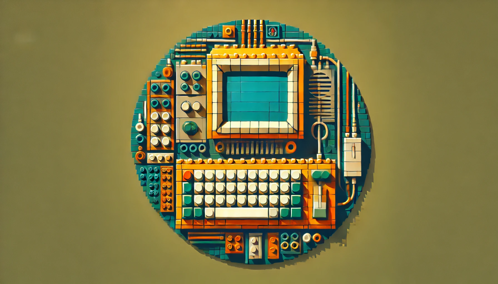<br><div align="left" style="font-family: 'Helvetica Neue Bold', Arial, sans-serif;"><strong>
    High-Level Application Architecture

</strong><br><br>
Overview of the application architecture, key components, and their interactions.

</div></td>
<td valign="top" align="center">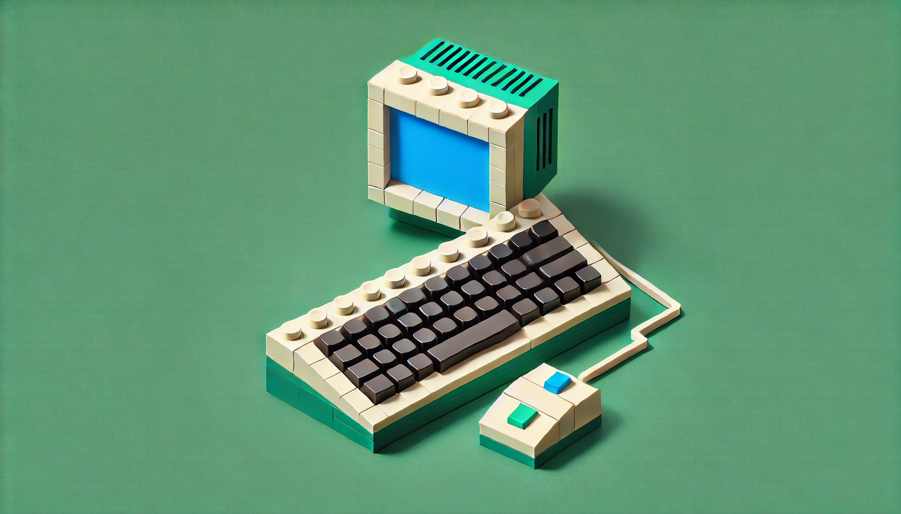<br><div align="left" style="font-family: 'Helvetica Neue Bold', Arial, sans-serif;"><strong>
    
</strong><br><br>
    
</div></td>
</tr>

<tr>
<td valign="top" align="center"><br><div align="left" style="font-family: 'Helvetica Neue Bold', Arial, sans-serif;"><strong>
    Version Control and Collaboration

</strong><br><br>
Importance of version control and best practices for collaboration.

</div></td>
<td valign="top" align="center">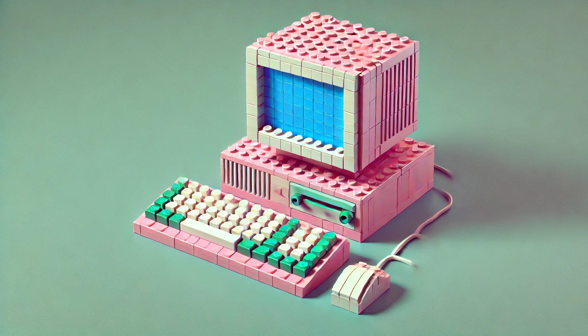<br><div align="left" style="font-family: 'Helvetica Neue Bold', Arial, sans-serif;"><strong>
    Implementing CI/CD Pipelines

</strong><br><br>
Setting up continuous integration and deployment pipelines, including tools and best practices.

</div></td>
<td valign="top" align="center"><br><div align="left" style="font-family: 'Helvetica Neue Bold', Arial, sans-serif;"><strong>
    Managing Cloud Infrastructure with Terraform

</strong><br><br>
Building the User Interface with React
Basics of React for building the user interface, including component structure and state management.

</div></td>
</tr>

<tr>
<td valign="top" align="center"><br><div align="left" style="font-family: 'Helvetica Neue Bold', Arial, sans-serif;"><strong>
Frontend State Management

</strong><br><br>
Introduction to Redux for managing application state, with examples.

</div></td>
<td valign="top" align="center">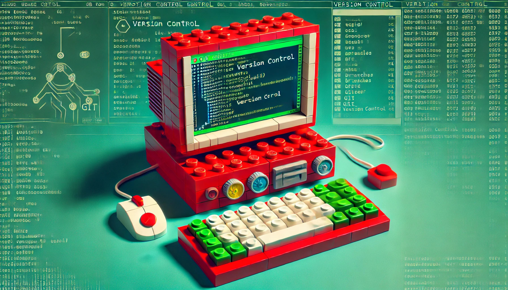<br><div align="left" style="font-family: 'Helvetica Neue Bold', Arial, sans-serif;"><strong>
    Architecting Cloud Infrastructure

</strong><br><br>
Designing the cloud infrastructure using services like Kubernetes and Docker.

</div></td>
<td valign="top" align="center"><br><div align="left" style="font-family: 'Helvetica Neue Bold', Arial, sans-serif;"><strong>
    Setting Up the Node.js Backend

</strong><br><br>
Basics of Node.js and Express, including how to structure the backend.

</div></td>
</tr>

<tr>
<td valign="top" align="center">
<br><div align="left" style="font-family: 'Helvetica Neue Bold', Arial, sans-serif;"><strong>
    Connecting the Frontend and Backend
</strong><br><br>
How to connect a React frontend with a Node.js backend, including setting up API routes and handling requests.    
</div></td>
<td valign="top" align="center"><br><div align="left" style="font-family: 'Helvetica Neue Bold', Arial, sans-serif;"><strong>
    Quality Assurance and Testing
</strong><br><br>
Overview of testing methodologies including unit, integration, and end-to-end testing, and the tools used for each.    
</div></td>
<td valign="top" align="center"><br><div align="left" style="font-family: 'Helvetica Neue Bold', Arial, sans-serif;"><strong>
    Steps to deploy the app on GCP, including tools and best practices for deployment.

</strong><br><br>
Description here. Beep Beep Boop.

</div></td>
</tr>

<tr>
<td valign="top" align="center"><br><div align="left" style="font-family: 'Helvetica Neue Bold', Arial, sans-serif;"><strong>
    Maintaining the Application

</strong><br><br>
Regular maintenance tasks and best practices for keeping the app up-to-date.

</div></td>
<td valign="top" align="center"><br><div align="left" style="font-family: 'Helvetica Neue Bold', Arial, sans-serif;"><strong>
    Performance Tuning
</strong><br><br>
    Techniques for improving performance, including profiling and optimization.
</div></td>
<td valign="top" align="center"><br><div align="left" style="font-family: 'Helvetica Neue Bold', Arial, sans-serif;"><strong>
    Cost Management and Optimization
</strong><br><br>
    Strategies for reducing costs, monitoring and optimizing cloud expenses.
</div></td>
</tr>

</table>

## 🚀 Tech Stack

The tech stack is carefully chosen to showcase modern full-stack development practices. Here's a breakdown:

<table style="width:100%">
  <tr>
    <th>Layer</th>
    <th>Technology</th>
    <th>Purpose</th>
  </tr>
  <tr>
    <td>
    <h5>
    Frontend
    </h5></td>
    <td>
    <span>
     React
     </span>
     </td>
    <td>UI development and rendering</td>
  </tr>
  <tr>
    <td>
    </td>
    <td>
    <span>
     Next.js
     </span>
     </td>
    <td>Server-side rendering, routing, and API endpoints</td>
  </tr>
  <tr>
    <td>
    </td>
    <td>
    
    <span>
     Mantine
     </span>
     </td>
    <td>UI components and styling</td>
  </tr>
  <tr>
    <td>
    </td>
    <td>
    <span>
     Redux Toolkit
     </span>
     </td>
    <td>State management</td>
  </tr>
  <tr>
    <td>
    </td>
    <td>
    <span>
     Socket.io Client
     </span>
     </td>
    <td>Real-time communication</td>
  </tr>
  <tr>
    <td>
    <h5>
    Backend
    </h5>
    </td>
    <td>
    <span>
     NestJS
     </span>
     </td>
    <td>Backend framework</td>
  </tr>
  <tr>
    <td>
    </td>
    <td>
    <span>
     TypeORM
     </span>
     </td>
    <td>Database ORM for managing entities and migrations</td>
  </tr>
  <tr>
    <td>
    </td>
    <td>
    <span>
     Socket.io
     </span>
     </td>
    <td>WebSocket server for real-time events</td>
  </tr>
  <tr>
    <td>
    <h5>
    Infrastructure
    </h5>
    </td>
    <td>
    <span>
     GCP
     </span>
     </td>
    <td>Cloud hosting and deployment</td>
  </tr>
  <tr>
    <td>
    </td>
    <td>
    <span>
     Docker
     </span>
     </td>
    <td>Containerization</td>
  </tr>
  <tr>
    <td>
    </td>
    <td>
    <span>
     Terraform
     </span>
     </td>
    <td>Infrastructure as Code (IaC)</td>
  </tr>
  <tr>
    <td>
    <h5>
    Testing
    </h5>
    </td>
    <td>
    <span>
     Jest
     </span>
     </td>
    <td>Unit and integration testing</td>
  </tr>
  <tr>
    <td>
    </td>
    <td>
    <span>
     Testing Library
     </span>
     </td>
    <td>UI testing</td>
  </tr>
  <tr>
    <td>
    </td>
    <td>
    <span>
     Storybook
     </span>
     </td>
    <td>Component testing and documentation</td>
  </tr>
</table>

## 📖 **Game Rules**

### Kind of Like Cards Against Humanity or Apples to Apples


1. **Setup**:

    - Players connect to a game session via a room code.
    - One player is selected as the "Dealer" for each round.

2. **Gameplay**:

    - The Dealer plays a black card with a prompt or question e.g., "Wy can't I sleep at night?").
    - The other players choose the funniest white card from their hand to complete the sentence or answer the question.
    - The Dealer reviews the responses and selects the one they find funniest.

3. **Winning**:

    - The player whose card is chosen wins that round and earns a point.
    - The first player to reach a predefined number of points wins the game.

4. **Additional "Fun"**:
    - The game is customizable with different rule variations to keep things interesting.

## 💻 **How to Run the Game Locally**

1. Clone the repository:
    ```bash
    git clone https://github.com/dandonahoe/crude-cards.git
    ```
2. Install dependencies:
    ```bash
    pnpm install
    ```
3. Run the development server:
    ```bash
    pnpm run reset
    ```
4. Open [http://localhost:3000](http://localhost:3000) in your browser to view the game.


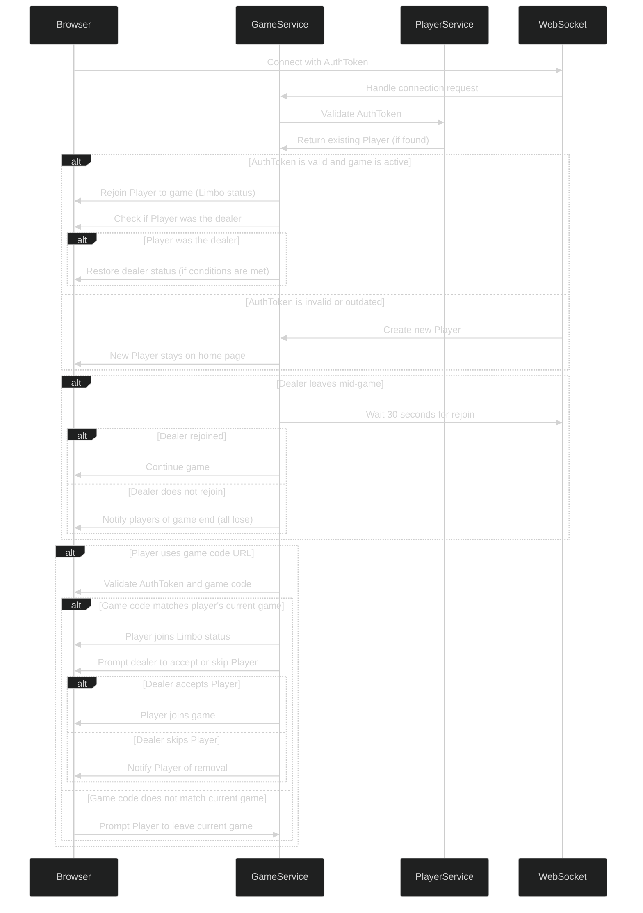

## 📜 **License**

This project is licensed under a **Creative Commons Attribution-NonCommercial-NoDerivatives (CC BY-NC-ND) License with Custom Terms**. You can learn from it, share it, and use it for educational purposes, but you must obtain permission for commercial use or any significant modifications.
