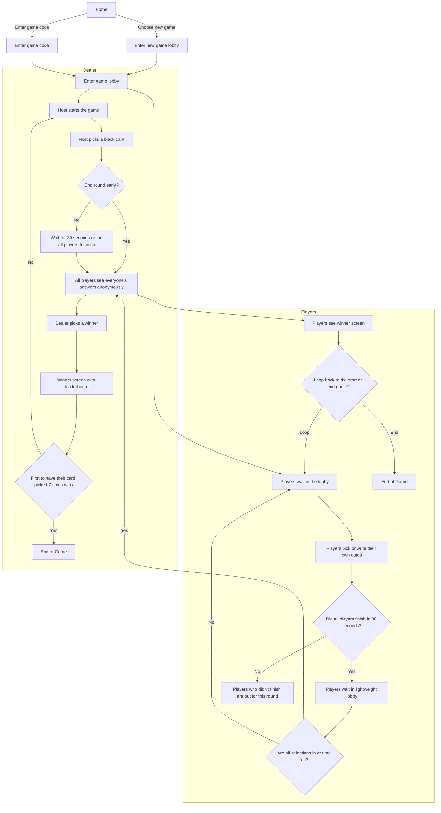

# 🎉 Crude Cards
## A Party Game For Horrible People! 🎉

Welcome to **Crude Cards**, a real-time, WebSocket-enabled card game designed for both learning and fun! If you've ever played **Cards Against Humanity** or **Apples to Apples**, you already know how to play. This project is built with modern web technologies like **React**, **Next.js**, and **NestJS** to demonstrate technical concepts in a fun and engaging way.

## 🎯 **Game Overview**

Crude Cards is a hilarious party game where you and your friends compete to create the funniest combinations possible. It's perfect for parties, casual hangouts, or even virtual game nights! The game is real-time, allowing multiple players to join, play, and interact with one another via a WebSocket-powered backend.

## 🤓 **Educational Purpose**

This game is more than just a source of entertainment. It's also a learning resource designed to showcase the development of a full-stack application with real-time capabilities. Throughout this repository, you'll find links to detailed tutorials on the various stages of building this project, from defining the architecture to deploying it in the cloud.

## 📖 **Game Rules (Just Like Cards Against Humanity or Apples to Apples)**

1. **Setup**: 
    - Players connect to a game session via a room code.
    - One player is selected as the "Dealer" for each round.

2. **Gameplay**:
    - The Dealer plays a black card with a prompt or question (e.g., "Why can't I sleep at night?").
    - The other players choose the funniest white card from their hand to complete the sentence or answer the question.
    - The Dealer reviews the responses and selects the one they find funniest.

3. **Winning**:
    - The player whose card is chosen wins that round and earns a point.
    - The first player to reach a predefined number of points wins the game.

4. **Additional Fun**:
    - The game is customizable with different rule variations to keep things interesting.

## 🚀 **Tech Stack**

The tech stack is carefully chosen to showcase modern full-stack development practices. Here's a breakdown:

| **Layer**      | **Technology**                              | **Purpose**                                       |
|----------------|---------------------------------------------|---------------------------------------------------|
| **Frontend**   | [React](https://reactjs.org/)               | UI development and rendering                      |
|                | [Next.js](https://nextjs.org/)              | Server-side rendering, routing, and API endpoints |
|                | [Mantine](https://mantine.dev/)             | UI components and styling                         |
|                | [Redux Toolkit](https://redux-toolkit.js.org/) | State management                                  |
|                | [Socket.io Client](https://socket.io/docs/v4/client-api/) | Real-time communication                           |
| **Backend**    | [NestJS](https://nestjs.com/)               | Backend framework                                 |
|                | [TypeORM](https://typeorm.io/)              | Database ORM for managing entities and migrations |
|                | [Socket.io](https://socket.io/)             | WebSocket server for real-time events             |
| **Infrastructure** | [GCP](https://cloud.google.com/)          | Cloud hosting and deployment                      |
|                | [Docker](https://www.docker.com/)           | Containerization                                  |
|                | [Terraform](https://www.terraform.io/)      | Infrastructure as Code (IaC)                      |
| **Testing**    | [Jest](https://jestjs.io/)                  | Unit and integration testing                      |
|                | [Testing Library](https://testing-library.com/) | UI testing                                      |
|                | [Storybook](https://storybook.js.org/)      | Component testing and documentation               |

## 📚 **Learning Resources and Tutorials**

Follow along with the full development process through the tutorials below:

- [**Defining the Project: What and Why**](https://www.notion.so/WIP-Defining-the-Project-What-and-Why-04f8e77dae2c4b7894da56738b1825cc?pvs=21)
- [**Conducting In-Person Testing and Gathering Feedback**](https://www.notion.so/WIP-Conducting-In-Person-Testing-and-Gathering-Feedback-7af8aeab5bd84788acf6d332d51a113b?pvs=21)
- [**Creating Mockups and Prototypes**](https://www.notion.so/WIP-Creating-Mockups-and-Prototypes-73897025582a44ef8887e6938ad7ea83?pvs=21)
- [**Building the User Interface with React**](https://www.notion.so/WIP-Building-the-User-Interface-with-React-0e8db9a08f38463fa4ac62ee3ff85e71?pvs=21)
- [**Implementing CI/CD Pipelines**](https://www.notion.so/WIP-Implementing-CI-CD-Pipelines-aa78af3790d3411ea8a1a5856fa686d9?pvs=21)
- [**Deploying on GCP**](https://www.notion.so/Steps-to-deploy-the-app-on-GCP-including-tools-and-best-practices-for-deployment-1c8fc473f9cc4904af523de1517ed666?pvs=21)

## 📊 **Interactive Panels and Resources**

- [**Storybook for UI Components**](https://your-storybook-link.com) - Explore the reusable UI components used in the game.
- [**CI/CD Pipeline Overview**](https://your-ci-cd-pipeline-link.com) - Monitor the status and structure of the CI/CD pipeline.
- [**API Documentation**](https://your-api-docs-link.com) - Detailed documentation for the backend APIs.

## 🎮 **Gameplay Flow - Mermaid Diagram**

## As Easy As 1,2,3,4,5,6,7,8,9,10



## 🎉 **For Fun and Learning**

This game is perfect for those who want to learn modern web development while enjoying a fun, interactive project. Whether it's for parties, casual hangouts, or just testing your development skills, **Crude Cards** has you covered.

## 💻 **How to Run the Game Locally**

1. Clone the repository:
   ```bash
   git clone https://github.com/ConstructWorks/cards.git
   ```
2. Install dependencies:
   ```bash
   pnpm install
   ```
3. Run the development server:
   ```bash
   pnpm dev
   ```
4. Open [http://localhost:3000](http://localhost:3000) in your browser to view the game.

## 📜 **License**

This project is licensed under a **Creative Commons Attribution-NonCommercial-NoDerivatives (CC BY-NC-ND) License with Custom Terms**. You can learn from it, share it, and use it for educational purposes, but you must obtain permission for commercial use or any significant modifications.


|  |  |  |
|:-----------------------------------------------------------------------------------------------------------:|:-----------------------------------------------------------------------------------------------------------:|:-----------------------------------------------------------------------------------------------------------:|
|  |  |  |
|  |  |  |
