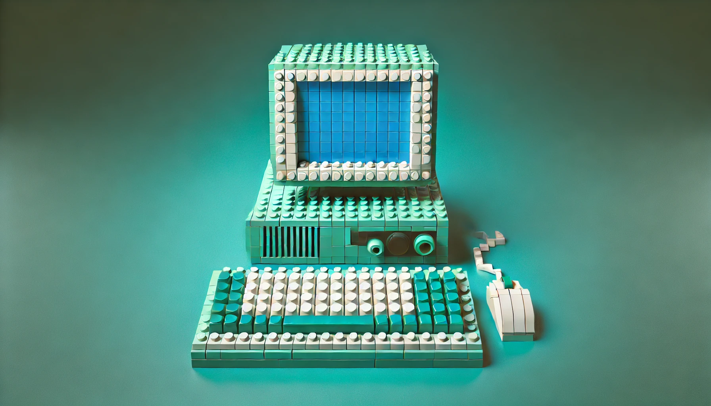

# 🎉 Crude Cards
## A Party Game For Horrible People! 🎉

Welcome to **Crude Cards**, a real-time, WebSocket-enabled card game designed for both learning and fun! If you've ever played **Cards Against Humanity** or **Apples to Apples**, you already know how to play. This project is built with modern web technologies like **React**, **Next.js**, and **NestJS** to demonstrate technical concepts in a fun and engaging way.

## 🎯 **Game Overview**

Crude Cards is a *good* party game for **bad** people. It's perfect for parties, casual hangouts, or even virtual game nights! The game is real-time, allowing multiple players to join, play, and interact with one another via a WebSocket-powered backend. It can be adapted to non-game scenarios, such as learning games or quizzes for instance.

## 🤓 **Educational Purpose**

This game is more than just a source of entertainment. It's also a learning resource designed to showcase the development of a full-stack application with real-time capabilities. Throughout this repository, you'll find links to detailed tutorials on the various stages of building this project, from defining the architecture to deploying it in the cloud.


## 🎨 CrudeCards - Game Dev Series

<table cellspacing="0" cellpadding="0" border="0">
  <tr>
    <td valign="top" align="center">
      <br>
      <div align="left" style="font-family: 'Helvetica Neue Bold', Arial, sans-serif;">
        <strong>TODO - Introduction to the Series</strong><br>
        <em>Beginner</em><br>
        Overview of the series, covering the goals of creating a CAH clone.
      </div>
    </td>
    <td valign="top" align="center">
      <br>
      <div align="left" style="font-family: 'Helvetica Neue Bold', Arial, sans-serif;">
        <strong>WIP - Defining the Project: What and Why</strong><br>
        <em>Beginner</em><br>
        Detailed description of the CAH clone, including its purpose and goals.
      </div>
    </td>
    <td valign="top" align="center">
      <br>
      <div align="left" style="font-family: 'Helvetica Neue Bold', Arial, sans-serif;">
        <strong>WIP - Defining the Audience and Stakeholders</strong><br>
        <em>Beginner</em><br>
        Identify the target audience and list stakeholders with their roles.
      </div>
    </td>
  </tr>
  <tr>
    <td valign="top" align="center">
      <br>
      <div align="left" style="font-family: 'Helvetica Neue Bold', Arial, sans-serif;">
        <strong>WIP - Defining Stakeholder Personas</strong><br>
        Process of creating example users and applying them to the project.
      </div>
    </td>
    <td valign="top" align="center">
      <br>
      <div align="left" style="font-family: 'Helvetica Neue Bold', Arial, sans-serif;">
        <strong>WIP - Conducting In-Person Testing and Gathering Feedback</strong><br>
        <em>Beginner</em><br>
        Methods for in-person testing and gathering feedback.
      </div>
    </td>
    <td valign="top" align="center">
      <br>
      <div align="left" style="font-family: 'Helvetica Neue Bold', Arial, sans-serif;">
        <strong>WIP - Creating Mockups and Prototypes</strong><br>
        <em>Beginner</em><br>
        Tools and techniques for creating mockups and prototypes, emphasizing their importance.
      </div>
    </td>
  </tr>
</table>

## 🚀 Tech Stack

The tech stack is carefully chosen to showcase modern full-stack development practices. Here's a breakdown:

<table style="width:100%">
  <tr>
    <th>Layer</th>
    <th>Technology</th>
    <th>Purpose</th>
  </tr>
  <tr>
    <td>Frontend</td>
    <td> React</td>
    <td>UI development and rendering</td>
  </tr>
  <tr>
    <td></td>
    <td> Next.js</td>
    <td>Server-side rendering, routing, and API endpoints</td>
  </tr>
  <tr>
    <td></td>
    <td> Mantine</td>
    <td>UI components and styling</td>
  </tr>
  <tr>
    <td></td>
    <td> Redux Toolkit</td>
    <td>State management</td>
  </tr>
  <tr>
    <td></td>
    <td> Socket.io Client</td>
    <td>Real-time communication</td>
  </tr>
  <tr>
    <td>Backend</td>
    <td> NestJS</td>
    <td>Backend framework</td>
  </tr>
  <tr>
    <td></td>
    <td> TypeORM</td>
    <td>Database ORM for managing entities and migrations</td>
  </tr>
  <tr>
    <td></td>
    <td> Socket.io</td>
    <td>WebSocket server for real-time events</td>
  </tr>
  <tr>
    <td>Infrastructure</td>
    <td> GCP</td>
    <td>Cloud hosting and deployment</td>
  </tr>
  <tr>
    <td></td>
    <td> Docker</td>
    <td>Containerization</td>
  </tr>
  <tr>
    <td></td>
    <td> Terraform</td>
    <td>Infrastructure as Code (IaC)</td>
  </tr>
  <tr>
    <td>Testing</td>
    <td> Jest</td>
    <td>Unit and integration testing</td>
  </tr>
  <tr>
    <td></td>
    <td> Testing Library</td>
    <td>UI testing</td>
  </tr>
  <tr>
    <td></td>
    <td> Storybook</td>
    <td>Component testing and documentation</td>
  </tr>
</table>


## 📖 **Game Rules (Just Like Cards Against Humanity or Apples to Apples)**

1. **Setup**: 
    - Players connect to a game session via a room code.
    - One player is selected as the "Dealer" for each round.

2. **Gameplay**:
    - The Dealer plays a black card with a prompt or question (e.g., "Why can't I sleep at night?").
    - The other players choose the funniest white card from their hand to complete the sentence or answer the question.
    - The Dealer reviews the responses and selects the one they find funniest.

3. **Winning**:
    - The player whose card is chosen wins that round and earns a point.
    - The first player to reach a predefined number of points wins the game.

4. **Additional "Fun"**:
    - The game is customizable with different rule variations to keep things interesting.


## 💻 **How to Run the Game Locally**

1. Clone the repository:
   ```bash
   git clone https://github.com/ConstructWorks/cards.git
   ```
2. Install dependencies:
   ```bash
   pnpm install
   ```
3. Run the development server:
   ```bash
   pnpm dev
   ```
4. Open [http://localhost:3000](http://localhost:3000) in your browser to view the game.

## 📜 **License**

This project is licensed under a **Creative Commons Attribution-NonCommercial-NoDerivatives (CC BY-NC-ND) License with Custom Terms**. You can learn from it, share it, and use it for educational purposes, but you must obtain permission for commercial use or any significant modifications.
